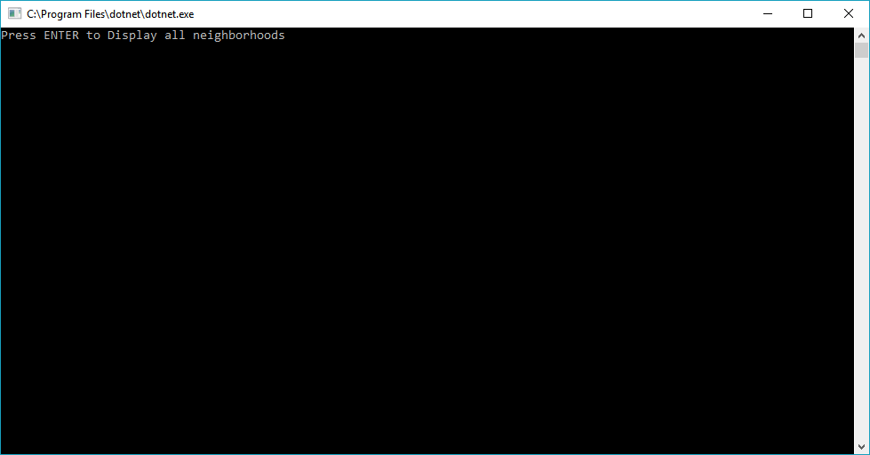
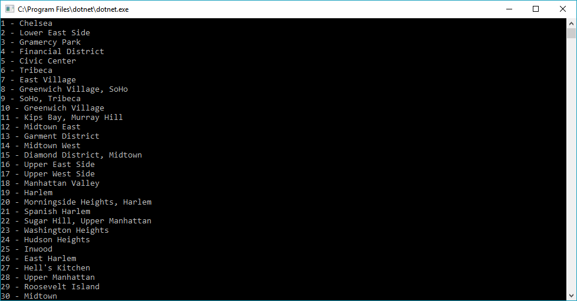

# LAB08-LINQ

## Introduction

This project is an exercise in utilizing .NET Language Integrated Query.
Within, a JSON file is parsed into .NET objects using Newtonsoft JSON.NET,
Queries are implemented using both LINQ format and Lambda expressions.

## Visuals

## Getting Started

To try out this program, clone this repository to your local files.

In Visual Studio, file > open > project/solution Navigate to where you cloned into local files.

Open "LINQ_in_Manhatten.sln" 

Debug > Start without debugging

Interact with the program through the console interface.